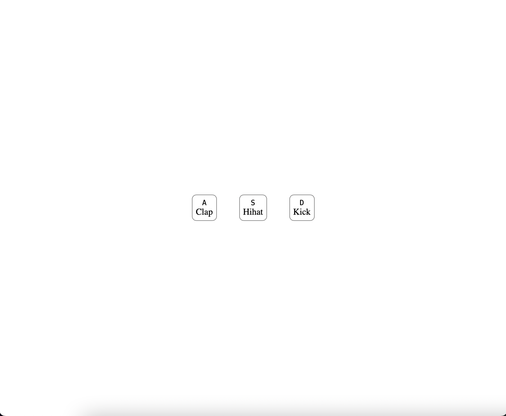

# Drumkit

## El proyecto incluirá los siguientes sonidos:
- [X] Efecto de sonido 'Clap'
- [X] Efecto de sonido 'Hi hat'
- [X]  Efecto de sonido 'Kick'

** Se planea agregar más efectos a futuro **

## También se incluye:
- [X] Reproducir sonido al presionar la tecla correspondiente
- [X] Al intentar reproducir el sonido varias veces seguidas, se detendrá la reproducción anterior del mismo sonido, de modo que suene más natural
- [X] Estilos a las teclas virtuales en su estado inicial
- [X] Estilos a las teclas virtuales al presionarla en el teclado
- [X] Transiciones de un estado al otro
- [X] Quitar el estilo de tecla presionada al soltar el teclado

Puedes ver el resultado [aqui](https://raymundosantorski.github.io/drumkit/).

    Debido a que busco poner efectos con buena calidad en el sonido, por ahora estoy limitado a estos que pude descargar de forma gratuita, en el futuro se agregarán más.
    La funcionalidad básica es la misma.